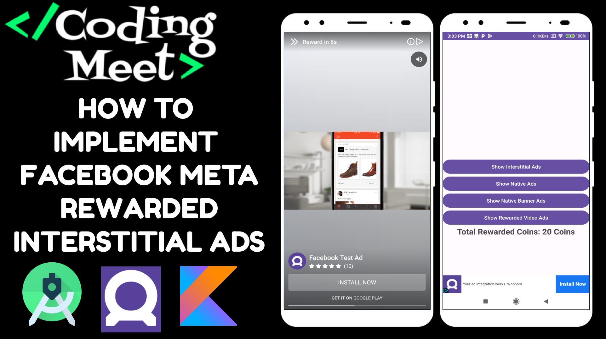

# Facebook Meta Ads in Android Studio Kotlin Tutorial Playlist

Welcome to the comprehensive tutorial playlist on integrating Facebook Meta Ads into your Android Studio projects using Kotlin. In this series, you'll learn step-by-step how to monetize your Android apps with different types of Facebook Meta Ads. Whether you're a beginner or an experienced developer, these tutorials will guide you through the process seamlessly.

## Tutorials

1. **[Implementing Facebook Meta Banner Ads](https://youtu.be/e2AjMd_4Wu0?si=tboy8mvUtfDm858c)**

   - Learn how to integrate Facebook Meta Banner Ads into your Android Studio project using Kotlin for effective app monetization.

2. **[Integrating Facebook Meta Interstitial Ads](https://youtu.be/9TXw6gVJrQw?si=K-AFebZJwctebxL1)**

   - Explore the process of implementing Facebook Meta Interstitial Ads in your Android Studio project with Kotlin for increased revenue.

3. **[Adding Facebook Meta Native Ads](https://youtu.be/8D5GqyTk_8c?si=3EjJRccigeovYAN1)**

   - Follow along to integrate Facebook Meta Native Ads seamlessly into your Android Studio project using Kotlin for a more native ad experience.

4. **[Implementing Facebook Meta Native Banner Ads](https://youtu.be/KHGLpAZEwfc?si=_9JzIJSDLYXaLr52)**

   - Learn how to integrate Facebook Meta Native Banner Ads into your Android Studio project using Kotlin for a harmonious user experience.

5. **[Integrating Facebook Meta Rewarded Video Ads](https://youtu.be/2y5pySMGSKk?si=8adM_kU7Wan9N3-r)**

   - Dive into the tutorial to implement Facebook Meta Rewarded Video Ads in your Android Studio project using Kotlin for rewarding user engagement.

6. **[Adding Facebook Meta Rewarded Interstitial Ads](https://youtu.be/JuO0JhKQL0o?si=NnJJzaNCLTrlqoa7)**

   - Explore how to implement Facebook Meta Rewarded Interstitial Ads in your Android Studio project using Kotlin for a combination of rewards and engagement.

Feel free to go through the tutorials in the order that suits your needs or jump to specific topics based on your requirements. Each tutorial provides clear instructions, code snippets, and tips to make the implementation process smooth and efficient.

If you find these tutorials helpful, don't forget to give them a thumbs up, share with your fellow developers, and subscribe for more insightful tutorials on Android app development and monetization strategies.

Happy coding!
